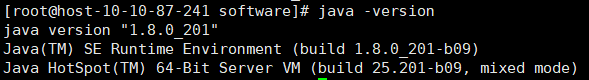

# CentOS虚拟机部署Hadoop-3.2.0(单节点、伪分布式)

## 1、安装rsync

> yum install rsync -y

## 2、关闭防火墙并禁止开机启动

> systemctl stop firewalld.service
>
> systemctl disable firewalld.service

## 3、在根目录下新建一个文件夹software(用来放jdk和hadoop的安装包)

> mkdir software

## 4、下载jdk和hadoop安装包并放到software文件夹下

由于下载jdk需要登录oracle，因此我在我本地的windows上先下载好jdk,这里需要的jdk版本是jdk-8u201。

进入[JDK下载地址](https://www.oracle.com/java/technologies/javase/javase8-archive-downloads.html)，获取需要的版本，这里我们下载***jdk-8u201-linux-x64.tar.gz***文件。

然后我们下载一下[hadoop-3.2.0](https://archive.apache.org/dist/hadoop/common/hadoop-3.2.0/)

下载hadoop-3.2.0.tar.gz:

下载好后用xftp将两个安装包拷贝到software目录下：

传输结束后退出xtfp, software目录下已有jdk和hadoop的压缩包。

## 5、安装JDK

### 5.1 解压JDK

> cd software

切换到software目录，执行命令：

> tar -zxvf jdk-8u201-linux-x64.tar.gz

解压后目录下会出现一个jdk1.8.0_201文件夹。

### 5.2 配置环境变量

修改/etc/profile文件：

> vim /etc/profile

在文件末尾加上：

> export JAVA_HOME=/software/jdk1.8.0_201
>
> export PATH=$JAVA_HOME/bin:$PATH

保存之后退出

### 5.3 使/etc/profile生效

> source /etc/profile

### 5.4 查看java版本

> java -version

java版本是1.8.0，说明jdk安装成功

## 6、配置Hadoop

### 6.1 解压Hadoop安装包（在software目录下）

> tar -zxvf hadoop-3.2.0.tar.gz

查看一下是否解压成功：

> ls

### 6.2 在Hadoop的配置文件etc/hadoop-env.sh中配置java环境

> cd hadoop-3.2.0

修改配置文件：

> vim etc/hadoop-env.sh

在文件末尾追加一句:

> export JAVA_HOME=/software/jdk1.8.0_201

保存之后退出。

### 6.3 查看Hadoop版本

还是在hadoop-3.2.0这个目录下执行命令：

> bin/hadoop version

版本正确，稳的。

## 7、运行Hadoop

有两个运行方式，单机运行和伪分布式运行，因为不是必须做的而且过程有点长，我就不记录了。可以看这个[链接](https://blog.csdn.net/u010476739/article/details/86647585)的第7点和第8点，只需要一步一步复制粘贴命令运行即可。

