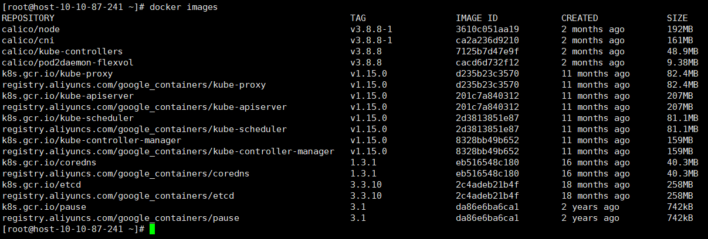

# 在CentOS虚拟机上部署Kubernetes (docker版本)

## 1、更新系统 安装常用软件

> yum update -y 
>
> yum install git wget vim -y

### 部署最新的docker版本并且将源替换为阿里云源

#### （1）安装一些必要的系统工具

> sudo yum install -y yum-utils device-mapper-persistent-data lvm2

#### （2）添加软件源信息

> sudo yum-config-manager --add-repo http://mirrors.aliyun.com/docker-ce/linux/centos/docker-ce.repo

#### （3）更新并安装Docker-CE

> sudo yum makecache fast
>
> sudo yum -y install docker-ce

#### （4） 开启Docker服务

> sudo service docker start

#### （5）配置镜像加速器

> sudo mkdir -p /etc/docker
>
> sudo tee /etc/docker/daemon.json <<-'EOF'
>
> {
>
> ​    "registry-mirrors": ["https://9w7g3j4y.mirror.aliyuncs.com"]
>
> }
>
> EOF
>
> sudo systemctl daemon-reload
>
> sudo systemctl restart docker

## 2、由于安装过程需要的很多组件的docker镜像都在外网，因此需要将docker安装源换为国内源

> cat <<EOF > /etc/yum.repos.d/kubernetes.repo

> [kubernetes]
>
> name=Kubernetes
>
> baseurl=https://mirrors.aliyun.com/kubernetes/yum/repos/kubernetes-el7-x86_64/
>
> enabled=1
>
> gpgcheck=1
>
> repo_gpgcheck=1
>
> gpgkey=https://mirrors.aliyun.com/kubernetes/yum/doc/yum-key.gpg https://mirrors.aliyun.com/kubernetes/yum/doc/rpm-package-key.gpg
>
> EOF

>yum makecache fast

## 3、关闭防火墙

> systemctl stop firewalld
>
> systemctl disable firewalld

## 4、禁用swap内存

> swapoff -a

修改/etc/fstab文件，注释掉SWAP的自动挂载:

> vim /etc/fstab

确认swap已经关闭:

> free -m

## 5、关闭SELINUX

> vim /etc/selinux/config

将SELINUX设置为disabled:

> SELINUX=disabled

然后执行：

> setenforce 0

> cat <<EOF >  /etc/sysctl.d/k8s.conf
>
> net.bridge.bridge-nf-call-ip6tables = 1
>
> net.bridge.bridge-nf-call-iptables = 1
>
> EOF

> sysctl --system

## 6、执行安装命令

这里可以直接执行：

> yum install -y kubelet kubeadm kubectl --disableexcludes=kubernetes

上面的命令是获取最新版的kubelet、kubeadm、kubectl组件。

如果不想用最新版，可以指定组件的版本号，这里我们指定kubernetes的版本为1.15.0：

> yum install kubeadm-1.15.0 kubelet-1.15.0 kubectl-1.15.0 -y

## 7、初始化启动

执行初始化命令（直接执行很可能会出错，请往下阅读）：

> kubeadm init --pod-network-cidr=192.168.0.0/16

现在执行上面的命令大概率会报错，原因是这条命令kubeadm会去镜像仓库拉取初始化需要的kubernetes组件的镜像，由于镜像在外网，所以出错，从错误提示信息可以知道我们安装的kubernetes需要的镜像和版本。解决报错的方法就是先从国内可以访问的镜像仓库中获取需要的镜像并提前下载到本地（***注意下载的镜像版本需要和报错信息提示的镜像版本相同，否则容易因为版本不匹配问题给后面的安装和开发过程挖坑 !***) 

由于前面安装的kubeadm和kubelet是1.15.0，这里我需要的所有组件及对应的版本如下：

> k8s.gcr.io/kube-apiserver:v1.15.0
>
> k8s.gcr.io/kube-controller-manager:v1.15.0
>
> k8s.gcr.io/kube-scheduler:v1.15.0
>
> k8s.gcr.io/kube-proxy:v1.15.0
>
> k8s.gcr.io/pause:3.1
>
> k8s.gcr.io/etcd:3.3.10
>
> k8s.gcr.io/coredns:1.3.1

也就是说需要从获取对应版本的kube-apiserver, kube-controller-manager, kube-scheduler, kube-proxy, pause, etcd, coredns 七个组件！下载组件之后还需要给组件分别打上上面的七个标签。

所有的组件我都是从阿里云的镜像仓库获取的（其他仓库能获取到相应版本的镜像也可），仓库地址是：`registry.aliyuncs.com/google_containers/`

分别拉取七个镜像，并将镜像打上标签。拉取镜像的命令是**docker pull**, 给镜像打标签的命令是**docker tag**

以第一个组件kube-apiserver为例，执行以下两个命令：

>  docker pull registry.aliyuncs.com/google_containers/kube-apiserver:v1.15.0

上面的命令就是拉取对应版本的kube-apiserver, 成功拉取到镜像之后再打上标签：

> docker tag registry.aliyuncs.com/google_containers/kube-apiserver:v1.15.0  k8s.gcr.io/kube-apiserver:v1.15.0

其他六个组件类似，分别执行docker pull和docker tag之后就可以执行最初的初始化命令了：

> kubeadm init --pod-network-cidr=192.168.0.0/16

初始化命令成功之后执行：

> export KUBECONFIG=/etc/kubernetes/admin.conf

> echo "export KUBECONFIG=/etc/kubernetes/admin.conf" >> ~/.bash_profile

docker容器之间需要相互通信还需要部署一下容器之间互通的网络，执行命令：

> kubectl apply -f https://docs.projectcalico.org/v3.8/manifests/calico.yaml

这个过程可能需要几分钟，稍等片刻。

几分钟后K8S的Master节点就部署好了。

我们查看一下集群的状态：

> kubectl get nodes

上面的命令是获取集群中的节点，目前只有一个master节点：

可以发现版本是1.15.0

还可以看看所有组件的状态是否正常：

> kubectl get pods --all-namespaces

如果status都是running就表示没有问题：

这样我们就部署好了一个单节点的Kubernetes。

#### P.S：部署的环境可能已经存在过别的版本的组件造成环境版本的混乱，可以听过docker images查看已有的镜像

> docker images

如果要删除不匹配版本的镜像，可以用命令

> docker rmi [仓库名]:tag

比如要删除kube-proxy, 可以 用命令：docker rmi registry.aliyuncs.com/google_containers/kube-proxy:v1.15.0

如果初始化报错，可以检查一下环境已有的镜像，确认版本和我们需要的是匹配的！

参考资料：

[鑫哥的K8S部署教程]([https://github.com/Jack-lizhiXin/Kubernetes_Doc/blob/master/kubernetes%E9%9B%86%E7%BE%A4%E9%83%A8%E7%BD%B2%EF%BC%88docker%E7%89%88%E6%9C%AC%EF%BC%89](https://github.com/Jack-lizhiXin/Kubernetes_Doc/blob/master/kubernetes集群部署（docker版本）))
